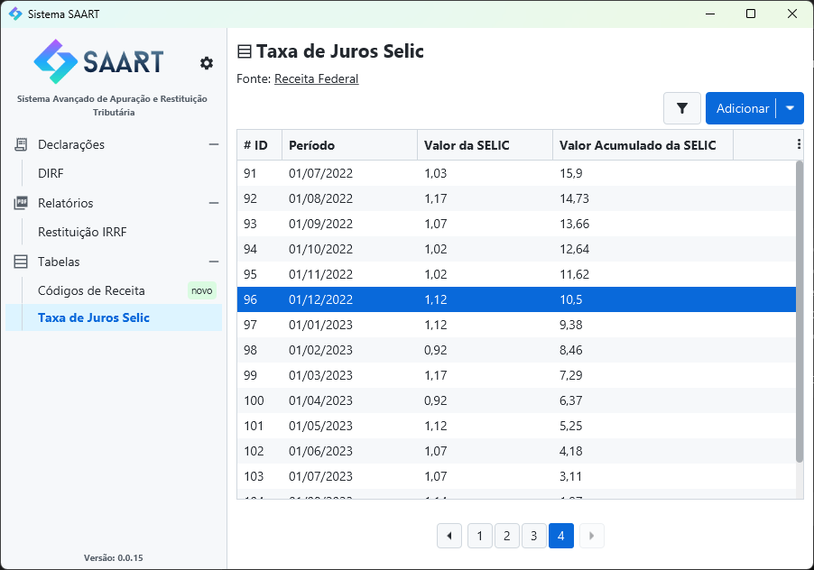

> **Aviso**: Este projeto foi desenvolvido como um protótipo (proof of concept) e estudo de caso, criado para explorar determinadas soluções e tecnologias. Ele cumpriu seu propósito como projeto de teste, mas não avançou para um produto final nem foi lançado no mercado. Ainda assim, o código está disponível como uma fonte de conhecimento, especialmente para quem busca exemplos práticos de Spring com JavaFX. Explore e aproveite!

## Sistema de extração de informações da DIRF

Este projeto permite a importação de DIRFs (Declaração de Imposto de Renda Retido na Fonte) realizadas por empresas, estruturando os dados para uma análise eficiente. Com base nas informações importadas, o sistema gera relatórios analíticos ou sintéticos, com possibilidade de agrupamento por ano ou por beneficiário, além de filtros específicos por código de receita.

O sistema também exibe uma lista dos arquivos importados, possibilitando a exclusão dos mesmos quando necessário. Além disso, possui duas tabelas de cadastro: uma para as alíquotas SELIC e outra para códigos da receita. Todas as visualizações do sistema podem ser filtradas, ordenadas e são paginadas para melhor navegação.

### Detalhes Técnicos

Este projeto foi desenvolvido com uma abordagem única, combinando **Spring** com **JavaFX** para criar uma aplicação de interface rica e robusta, uma combinação pouco comum que funciona com sucesso neste contexto. Esse aspecto faz do projeto uma referência incomum e valiosa para quem deseja explorar a integração entre Spring e JavaFX.

O sistema incorpora tecnologias como **Lombok** para redução de boilerplate, **Flyway** para migrações de banco de dados, **OpenFeign** para chamadas HTTP simplificadas, e **JasperReports** para geração de relatórios. Para facilitar a distribuição, acompanha um script **Inno Setup**, permitindo empacotar o projeto como um executável pronto para instalação em ambientes de cliente. Esse instalador é capaz de gerenciar a instalação de dependências essenciais, incluindo o banco de dados **Postgres**, **Java**, e o **DBeaver**. Ele também configura um desinstalador completo e oferece um sistema de auto-atualização para manter o software sempre na versão mais recente.
